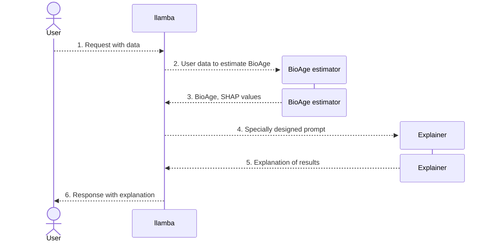

<p align="center">
<a href='https://github.com/MShawon/github-clone-count-badge'></a>
</p>


# llamba &mdash; a bridge between a BioAge estimator and explainer


## What is it?
**llamba** is a Python package that acts as a connector between a model that estimates a person's biological age and a chat model that explains the results. It is developed in order to provide more clarity to users of various BioAge predictors.



The diagram above explains the expected workflow of llamba:

1. User creates a request providing his sample data, a model to use, and a dataset on which the model was trained.
2. llamba runs a BioAge estimation model inference.
3. llamba receives BioAge along with SHAP values which are filtered to just 5 most influential features.
4. llamba designs a special prompt that asks Explainer (a specially-trained LLM model) to describe the results. A prompt may look like so: `What is X? What does an increased level of X mean?`, where X is a feature.
5. Explainer returns the explanation with some information about the most important features.
6. User receives an explanation with some graphs which demonstrate how his result compares with other peoples'.

This is the framework part of llamba that is responsible for communication with an LLM model and integration with the [llamba library](https://github.com/SermanVS/llamba_library).

## Table of contents

- [Main Features](#main-features)
- [Installation](#installation)
- [Usage](#usage)
- [Dependencies](#dependencies)
- [TODO](#todo)
- [License](#license)

## Main features

- Supports various BioAge estimation models due to a special wrapper class that requires the model to implement necessary methods.
- Supports various chatbot explainers.
- Has an ability to show graphs where users can see their results compared to other participants.

## Installation

You can download the sources and install them via Poetry by running the following command in the library's root directory:

`poetry install`

## Usage

### Test

To test that the library works, you can run the following notebook sample:

```python
from llamba.chatmodels.chat_model import AbstractChatModel
from llamba_library.bioage_model import BioAgeModel
from llamba.connector import LlambaConnector
import torch
from torch import nn
import pandas as pd
import numpy as np

# Prepare data to analyze
num_features = 10
features = np.random.randint(low=1, high=150, size=num_features).astype(np.float32)
age =  np.random.randint(low=10, high=90)

data = pd.DataFrame([{f'Feature_{i}' : features[i] for i in range(num_features)}])
data['Age'] = age

# Prepare a BioAge model
class DummyBioAgeModel(nn.Module): 
    def __init__(self): 
        super(DummyBioAgeModel, self).__init__()
        self.linear1 = torch.nn.Linear(10, 1)

    def forward(self, x):
        x = self.linear1(x)
        return abs(x)

model = DummyBioAgeModel()
bioage_model = BioAgeModel(model)

# Prepare a Chatbot model
class DummyChatModel(AbstractChatModel): pass
chat_model = DummyChatModel()
connector = LlambaConnector(bioage_model=bioage_model, chat_model=chat_model)

res = connector.analyze(data)
print(res['analysis'])
```

You can also run a test by executing the following command in the library root directory:

`pytest`

### Locally hosted LLM

A popular solution is to run an LLM on localhost (like [ollama](https://ollama.com/)), so we have implemented the support for it.

. Run `ollama serve` in your terminal.

. Proceed with creating a workflow as shown in the [Ollama sample](./samples/immunoage_meet_ollama.ipynb) notebook.

### Locally stored LLM

Another popular way to utilize LLMs is to have a model stored locally and run inference using something like [huggingface API](https://huggingface.co/). We are working on a way to support locally stored LLMs as well.

```python
WIP
```

### Externally hosted LLM

Currently, there is implementation for a Chatbase chatbot. You can find the usage example in the [Chatbase analysis](./samples/immunoage_meet_chatbase.ipynb) notebook.

## Dependencies

- [Pandas](https://github.com/pandas-dev/pandas) &mdash; allows to comfortably work with data using frames.
- [NumPy](https://numpy.org/) &mdash; a convenient way to work with numerical data.
- [SciPy](https://scipy.org/) &mdash; implementation of many functions for statistical purposes.
- [Shap](https://github.com/shap/shap) &mdash; allows to see how some parameters affect the end result for an ML model.
- [PyTorch](https://pytorch.org/) &mdash; allows to work with ML models.

## TODO

1. Add a wrapper for a locally stored model (huggingface integration).
2. Add a wrapper for ChatGPT.
3. Provide more configurability for all the wrappers.

## License

Under construction.
